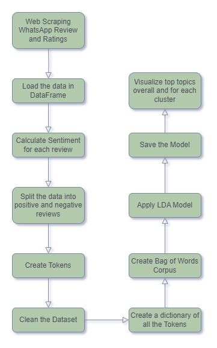

# Topic-Modelling-on-WhatsApp-Reviews

This is an NLP project where we first scrape WhatsApp Revies from the Play store. Then we Try to find topics in positive and negative sentiment reviews

### Web Scraping

- Using a combination of Selenium and BeautifulSoup to scrape WhatsApp Reviews and storing them in a csv File

### The following Predictive modelling was performed:

- Sentimental Analysis using a pre-trained model, TextBlob was used to extract the negative and positive reviews.
- Dividing the reviews into positive and negative reviews.
- Created Bag of Words Embedding using Count Vectorizer.
- Used Gensim library for Topic Modelling using Latent Dirichlet Allocation (LDA).

### Flow Chart

### The following Top Positive words generated

### The following Top Negative words generated

